Projet: Data Migration Platforme
Azure: Cloud, Python: 3.12, Terraform: 1.15, CICD: GitHub Actions, Docker: Container.

Plateforme cloud native de migration et de traitement de données sur Microsoft Azure. Architecture événementielle, haute disponibilité, niveau production.

Table des matières :
- Présentation
- Architecture
- Composants
- Prérequis
- Déploiement rapide
- Structure du projet
- CI/CD
- Monitoring
- Auteur

Présentation :
J'ai conçu et réalisé une plateforme cloud native de migration et de traitement de données sur Microsoft Azure, capable de gérer des flux de données à grande échelle de manière fiable, sécurisée et résiliente.
Cette solution met en œuvre les meilleures pratiques de l'ingénierie des données et de l'architecture cloud moderne afin de garantir la traçabilité, l'observabilité et la continuité de service dans des environnements de production exigeants.

Objectifs atteints :
- Architecture événementielle entièrement découplée et scalable
- Automatisation complète du cycle de déploiement (CI/CD)
- Garanties de fiabilité via idempotence et reprise sur erreur
- Supervision proactive avec alertes automatiques
- Infrastructure reproductible et versionnée (Terraform)

Capture d'écrans :
1. Dashboard Azure Monitor
          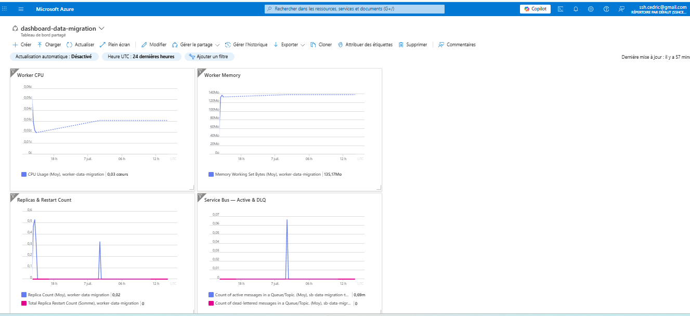
2. CI/CD GitHub Actions
          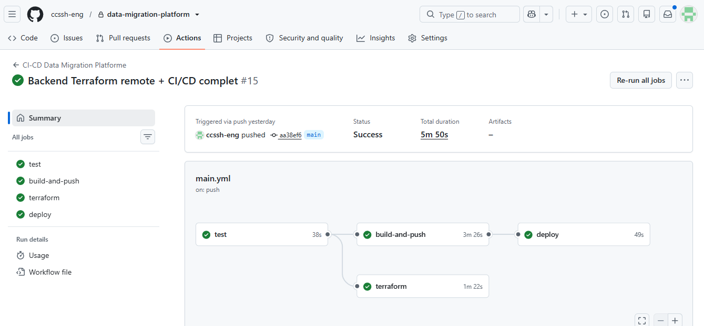
3. Service Bus — Dead Letter Queue
          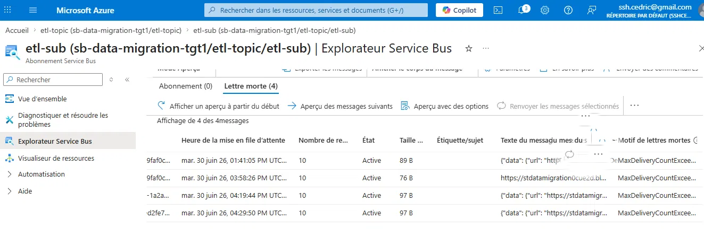
4. Azure Container Apps
          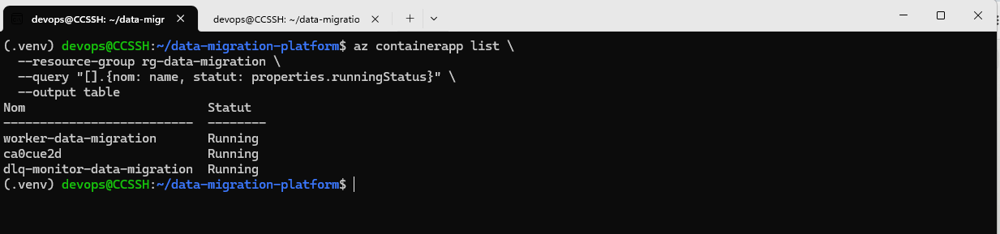
5. Structure du projet
          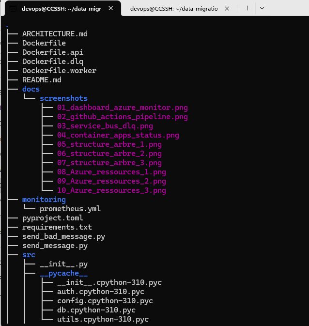
          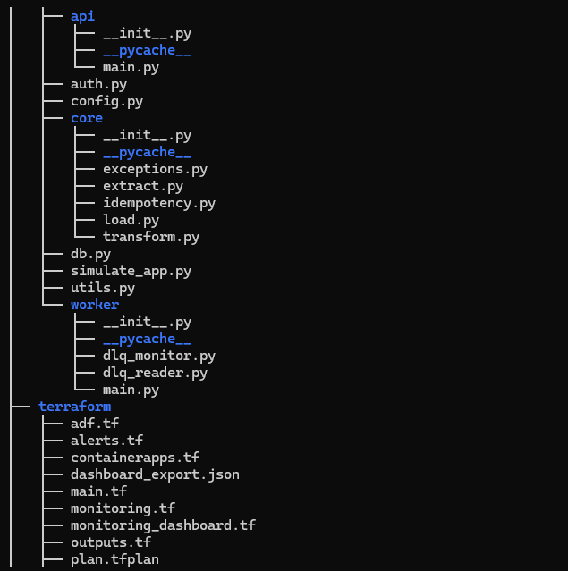
          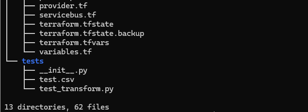
          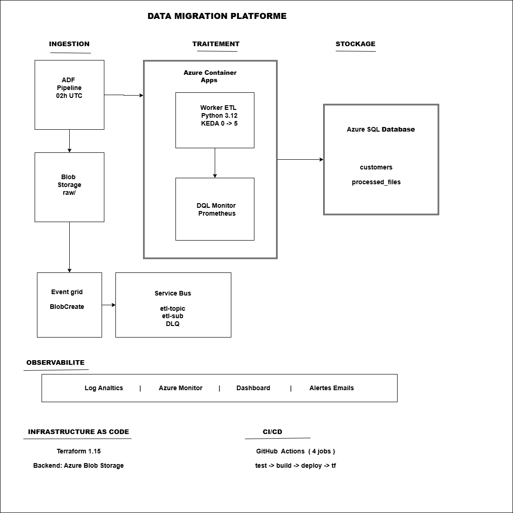
Architecture :
          
Flux de données :

1. ADF Pipeline (cron 02h00 UTC)
   - Extrait les données SQL => CSV => Blob Storage (raw/)
2. Event Grid détecte BlobCreated
   - Envoie un message à Service Bus (etl-topic/etl-sub)
3. KEDA détecte messageCount > 0
   - Scale up le Worker (0 => N replicas)
4. Worker ETL traite le message
   - Extract  : télécharge le CSV depuis Blob Storage
   - Transform: nettoie, valide, standardise les données
   - Load     : insère dans Azure SQL
5. Idempotence
   - Vérifie processed_files avant chaque traitement
6. Gestion des erreurs
   - ValidationError -> DLQ immédiate
   - Exception -> Retry automatique (max 10)
   - MaxRetriesExceeded -> DLQ
7. DLQ Monitor
   - Log la raison + expose métrique Prometheus
   - Alerte email via Azure Monitor

Composants :
Composant    |             Technologie          |              Rôle

Worker ETL	Python 3.12 / Container App	      Extract -> Transform -> Load
DLQ Monitor	Python 3.12 / Container App	      Surveillance Dead Letter Queue
ADF Pipeline	Azure Data Factory	              Export quotidien SQL -> CSV
Message Broker	Azure Service Bus (Standard)	       Découplage producteur/consommateur
Auto-scaling	KEDA	                               Scale 0 -> 5 replicas selon messageCount
Base de données	Azure SQL Database	               Stockage des données migrées
Stockage        Azure Blob Storage	               Fichiers CSV intermédiaires
Registry        Azure Container Registry	       Images Docker
IaC	        Terraform 1.15	                       Provisionnement infrastructure
CI/CD	        GitHub Actions                         Build, Test, Deploy
Monitoring	Azure Monitor + Log Analytics	       Observabilité complète

Prérequis :
Outils locaux :

az --version        # Azure CLI >= 2.50
terraform version   # Terraform >= 1.15
python3 --version   # Python >= 3.12
docker --version     # Docker >= 24.0

Azure :
- Subscription Azure active
- Droits Contributor sur le Resource Group
- Azure Container Registry (ACR)
- Azure SQL Server avec admin Entra ID

Déploiement rapide :
1. Cloner le repo
git clone https://github.com/ccssh-eng/data-migration-platform.git
2. Configurer les variables Terraform
cat > terraform/terraform.tfvars << 'EOF'
servicebus_connection_string = "Endpoint=sb://..."
sql_server                   = "sql0cue2d.database.windows.net"
sql_database                 = "migration-db"
acr_username                 = "acr0cue2d"
acr_password                 = "mon-Acr-Mot-De-Passe"
EOF
3. Déployer l'infrastructure
cd terraform
terraform init
terraform plan
terraform apply
4. Builder et pousser les images
az acr build --registry acr0cue2d \
  --image data-worker:latest --file Dockerfile.worker .
az acr build --registry acr0cue2d \
  --image dlq-monitor:latest --file Dockerfile.dlq .
5. Tester le pipeline
python3 send_bad_message.py bad    # Tester DLQ
python3 send_bad_message.py good   # Tester le chemin heureux

CI/CD :
push -> main
    - JOB 1: test               # pytest tests/ -v
    - JOB 2: build-and-push     # az acr build (worker + dlq)
    - JOB 3: deploy             # az containerapp update
    - JOB 4: terraform          # plan + apply

Secrets GitHub requis :
Secret	                     |               Description

AZURE_CREDENTIALS	               Service Principal JSON
SERVICEBUS_CONNECTION_STRING	       Connection string Service Bus
SQL_SERVER	                       FQDN du serveur SQL
SQL_DATABASE	                       Nom de la base de données
ACR_USERNAME	                       Username ACR admin
ACR_PASSWORD	                       Password ACR admin

Monitoring :
Alertes configurées :
Alerte	             |          Condition	    |   Sévérité

dlq-alert	        DeadletteredMessages > 0           Warning
active-messages-alert	ActiveMessages > 10                Warning
worker-restart-alert	RestartCount > 3	           Critical
worker-cpu-alert	CPU > 80%	                   Warning
worker-memory-alert	Memory > 80%	                   Warning

Mes ressources sur Azure Cloud :
    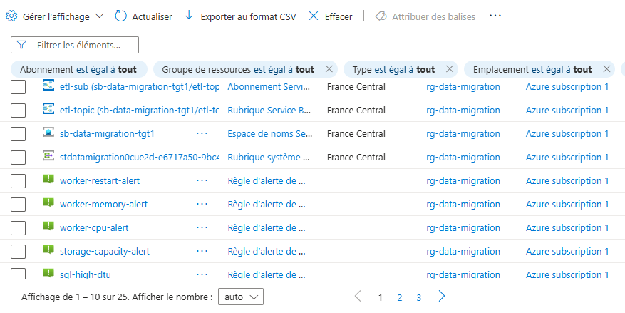
    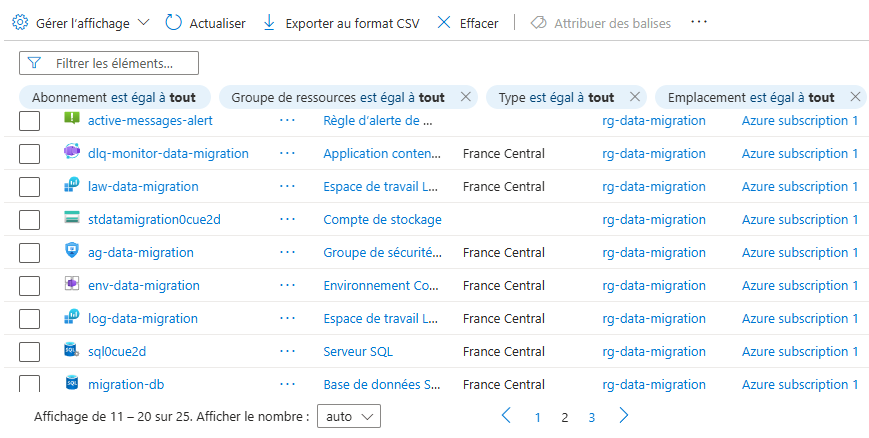
    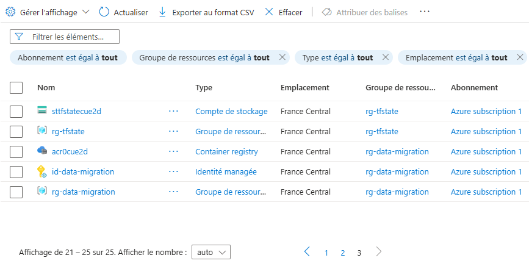

Commandes utiles :
# Logs Worker en direct :
az containerapp logs show --name worker-data-migration \
  --resource-group rg-data-migration --type console --follow

# Messages Service Bus :
az servicebus topic subscription show \
  --namespace-name sb-data-migration-tgt1 \
  --resource-group rg-data-migration \
  --topic-name etl-topic --name etl-sub \
  --query '{actif: countDetails.activeMessageCount, dlq: countDetails.deadLetterMessageCount}'

# Déclencher ADF manuellement :
az datafactory pipeline create-run \
  --factory-name adf-data-migration-0cue2d \
  --resource-group rg-data-migration \
  --name pipeline-export-customers

Auteur :
Cédric SSH Architecte Cloud Azure | Ingénieur Data

